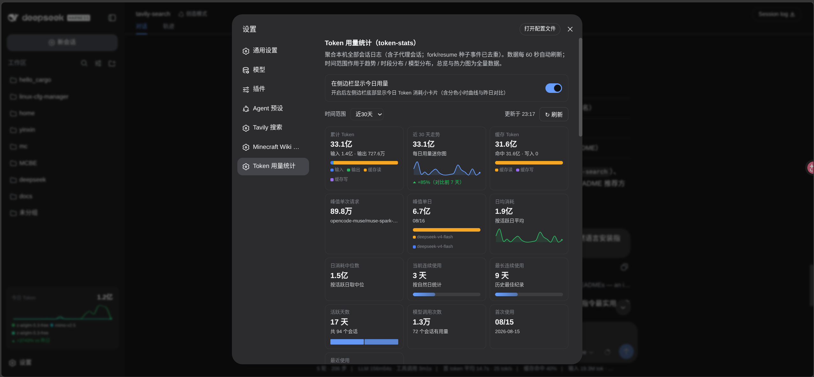
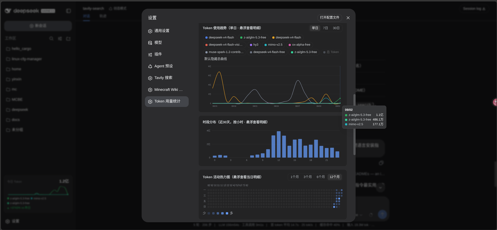
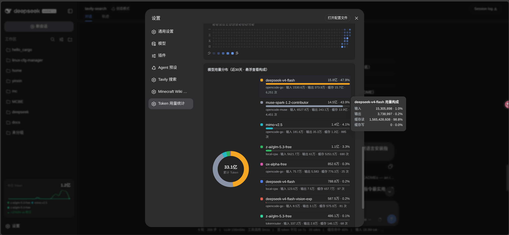
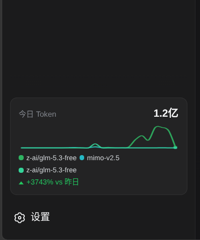

# @dshp-inx/token-stats

DeepSeek Harness（DSH) 统计插件：聚合本机全部会话日志的 Token 用量，在**设置页**展示；侧边栏底部附带「今日用量」常驻入口。

## 功能

- **总览**：累计 Token（输入/输出/缓存分解）、峰值单次请求、峰值单日、当前/最长连续使用天数、活跃天数、会话数、调用次数、首次/最近使用
- **趋势**：按日/按周使用趋势线图（含累计曲线）+ 24 小时时段分布
- **热力图**：GitHub 风格近一年 Token 活动热力图（悬停显示当日用量）
- **模型分布**：环形图 + 各模型明细（占比、输入/输出/缓存分解、调用次数）
- **今日入口**：侧边栏底部今日用量 + 逐小时模型堆叠图 + 昨日对比
  （标题栏 `⠿` 按住拖出 / `⧉` 点按即弹为可拖拽浮窗，双击或 `📌` 收回；弹出后侧边栏零占位，设置页"今日卡片浮窗"行可一键收回）
- **时间范围**：近 7/30/90 天 / 全部
- **动效**：指标数字滚动、曲线描边生长、直方图柱子升起、热力图逐列点亮、环形图展开、tooltip 弹入（均遵循系统「减弱动态效果」设置；仅首次打开播放，增量更新直接落值、不重播）
- **悬浮**：全部图表悬浮信息均为自绘制 fixed 悬浮（跟随鼠标 + 视口边缘翻转），禁用原生 tooltip；卡片悬停浮起用 top 实现，不劫持悬浮定位
- **刷新**：60s 基线 + 切回即刷 + partial 渐进加速（2s 起步、无进展退避 12s）；请求守卫防叠加、无变化跳过渲染；单会话读取 20s 超时防泵钉死

## 效果预览

**设置页 · 总览指标卡与使用趋势**（指标卡可视化 + 单日/7日/30日趋势平滑曲线，悬浮查看明细）：



**设置页 · 时段分布与活动热力图**（24 小时直方图 + GitHub 风格年度热力图，悬浮查看当日明细）：



**设置页 · 模型用量分布**（环形图 + 各模型明细，颜色与趋势图一致）：



**侧边栏 · 今日用量入口**（今日逐小时模型堆叠 + 昨日对比）：



## 统计口径

- 总 Token = inputTokens + cacheReadTokens + cacheWriteTokens + outputTokens
  （reasoningTokens 已含在 outputTokens，不重复计）
- 同一 (turn, step) 的 usage chunk 为早期采样、assistant/message usage 为终值，覆盖不重复累计
- fork/resume 会话跳过其 seedLength 条种子事件（父会话已计），不重复计数
- 含子代理会话（它们是真实用量）

数据源是 `sessionQuery` 服务实时扫描会话日志，无独立持久化——会话日志本身就是持久层。

## 安装（推荐：GitHub）

```sh
dsh plugin --profile web add github:Yinxe/dsh-token-stats
```

`dsh plugin` 把参数转发给 profile 目录里的 pnpm，装完自动把插件写进 profile 的 `dsh.profile.bundles` 挂载列表 —— **无需手动改任何配置文件**。

**一键 AI 安装**：把下面这段直接发给你的 DSH AI（复制即用，无需修改）：

```text
帮我安装 Token 用量统计插件（GitHub 仓库 Yinxe/dsh-token-stats，包名 @dshp-inx/token-stats）：
1. 执行 dsh plugin --profile web add github:Yinxe/dsh-token-stats
2. 重启 web 服务（dsh web），确认重启无报错
3. 验证插件已生效（设置页出现「Token 用量统计」卡片，侧边栏底部出现「今日」用量入口）
4. 打开设置页的 Token 用量统计，告诉我累计 Token 总量和今日用量
```

重启生效：

```sh
dsh web
```

**验证**：打开 web 页面 → 设置 → Token 用量统计；侧边栏底部出现「今日」用量入口。

## 更新

```sh
dsh plugin --profile web update "@dshp-inx/token-stats" --latest
dsh web
```

`update --latest` 会让 pnpm 重新解析 GitHub 仓库的最新 commit 并更新 lockfile；重启后生效。

## 安装（备选：clone 源码 + 本地 link）

适合想改源码、或 GitHub 不可达的场景。clone 后用 `add ./<目录>` 安装 —— **依赖同样按插件真实包名（`@dshp-inx/token-stats`）登记**，后续 update / remove 与 GitHub 安装完全一致。link 安装的源码改动**即时生效**（client 半刷新页面即可，host 半需重启 `dsh web`）：

```sh
git clone git@github.com:Yinxe/dsh-token-stats.git ~/.dsh/plugins/dsh-token-stats
cd ~/.dsh/plugins
dsh plugin --profile web add ./dsh-token-stats
dsh web
```

> `add ./<目录>` 的相对路径按**你执行命令时所在的目录**解析，先 `cd` 到插件目录的父级再执行。
> ⚠️ **不要直接编辑 `node_modules/@dshp-inx/token-stats/` 里的文件**：pnpm 的安装文件与内容寻址 store 硬链接，直接覆盖会连带改坏 store。改源码请改 clone 出来的源码目录。

link 方式的更新就是 `git pull`（源码目录）+ 刷新页面/重启。

## 卸载

```sh
dsh plugin --profile web remove "@dshp-inx/token-stats"
dsh web
```

`remove` 会自动从 `dsh.profile.bundles` 撤下挂载；clone 安装的再删掉 `~/.dsh/plugins/dsh-token-stats` 目录即可。

## 配置（标准 settings 存储）

用户偏好持久化到 `settings.yaml` 的 `dshp-inx-token-stats` 命名空间，设置页改完即时生效，外部编辑热重载：

```yaml
dshp-inx-token-stats:
  showToday: false   # false=设置页折叠今日入口，true 显示侧边栏关联
  defaultRange: "30" # 默认时间范围：7 | 30 | 90 | all
```

`cordis.patch.yml` 的 `config:` 仍可覆盖默认值（settings 的 base 层）。

## 同源路由

| 方法 | 路径 | 作用 |
|------|------|------|
| GET | `/ext/dshp-inx-token-stats/data` | 聚合快照（overview/trend/heatmap/models/today） |
| GET | `/ext/dshp-inx-token-stats/state` | 当前偏好快照（showToday/defaultRange） |
| POST | `/ext/dshp-inx-token-stats/config` | 保存偏好补丁，写 `settings.yaml` |

全部带同源校验与 `no-store`。

## 测试

```sh
npm test                          # fold ×7 + fsindex ×4 + async ×4
node --check lib/index.js && node --check client.js
```

## 代码结构

```
lib/index.js     Host 半：sessionQuery 聚合 + 标准 settings 偏好（showToday/defaultRange）+ 偏好路由
lib/engine.js    聚合引擎（指纹持久缓存 + 后台渐进扫描 + 队列合并 + 删会话清理）
lib/fsindex.js   会话日志文件索引/指纹/seed 跳过（纯 node:fs，可单测）
lib/fold.js      会话日志折叠抽取（usage 终值覆盖采样、seed 跳过、路由半更新）
lib/http.js      同源 JSON 路由（GET /ext/dshp-inx-token-stats/data，no-store）
client.js        Client 半：__ModuleLoader__ bundle，设置页 + 侧边栏今日入口
cordis.patch.yml bundle 层 patch：仅 insert 挂载行（id: dshp-inx-token-stats）
test/            单元测试（npm test：fold 抽取 ×7 + fsindex ×4 + async ×4）
images/          效果预览截图（README 引用）
```

## 免责声明

- 统计数据全部来自本机会话日志，无网络上报、无独立持久化；
- 本插件与 DeepSeek 官方无隶属关系。
